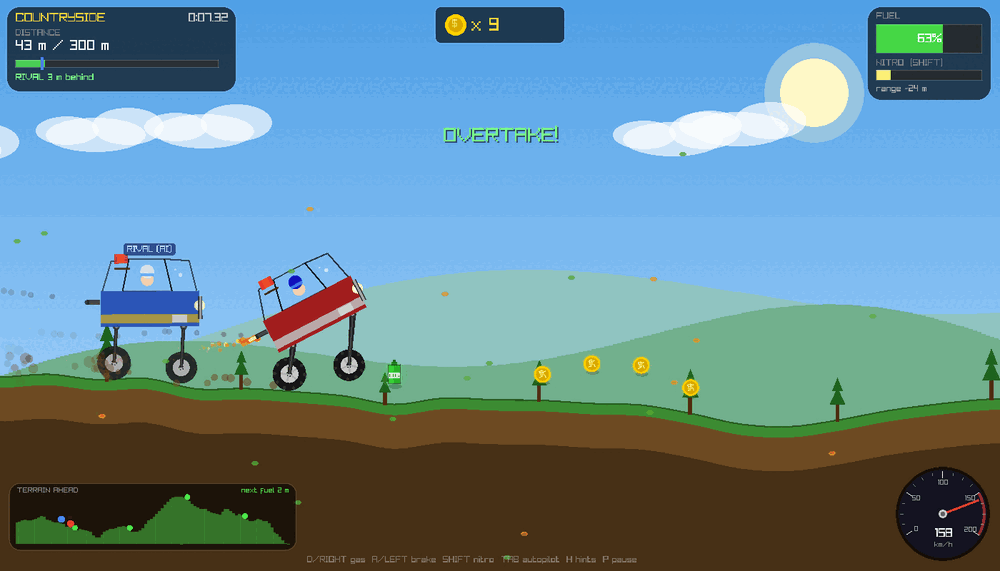
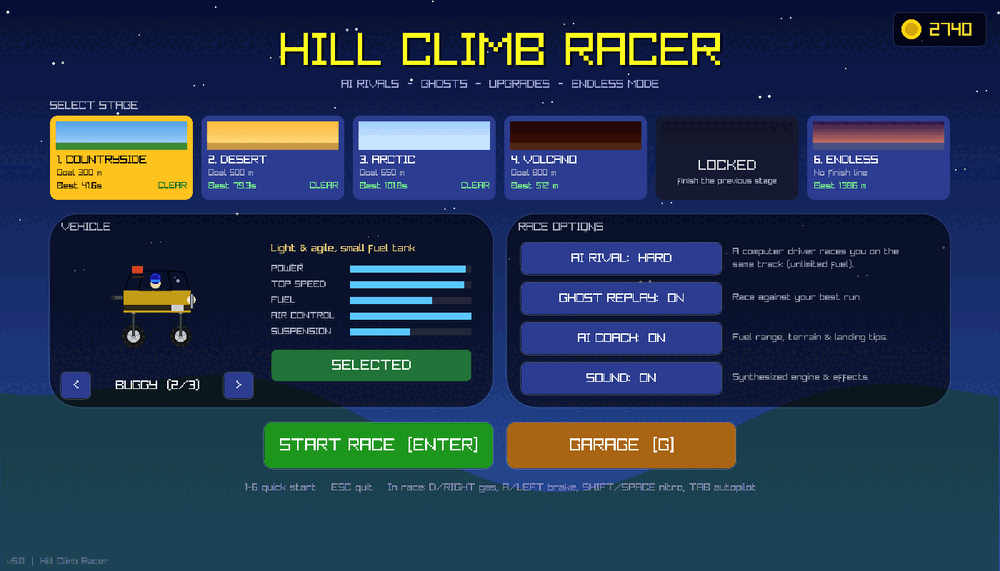
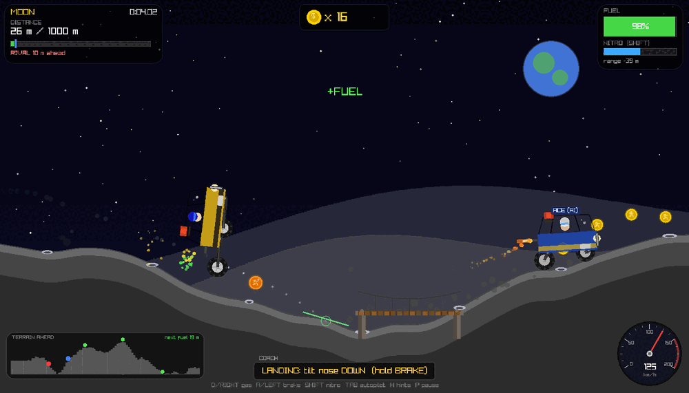
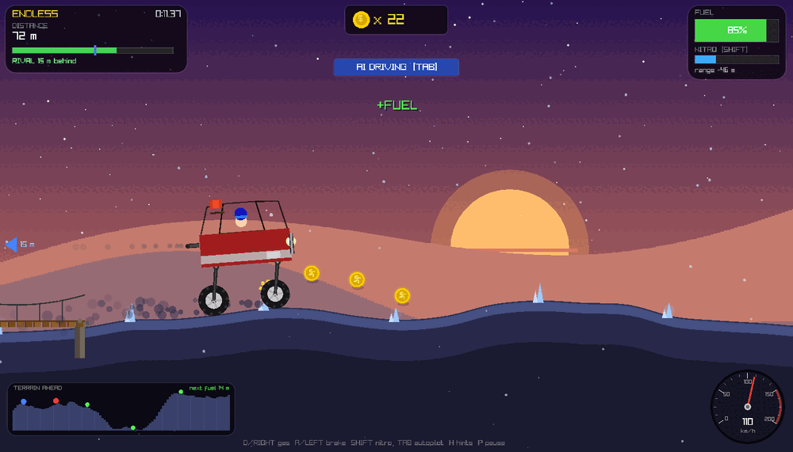
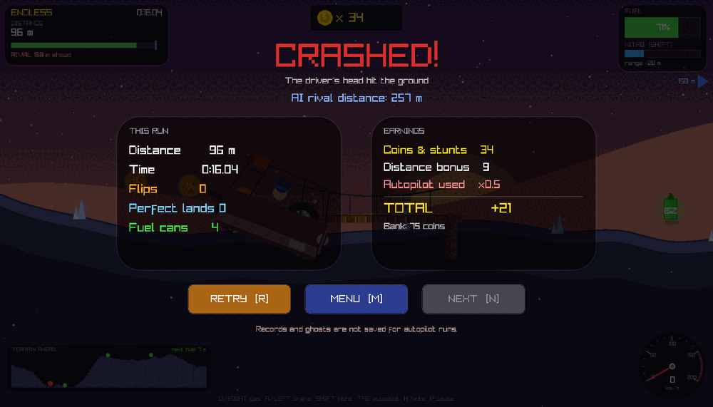
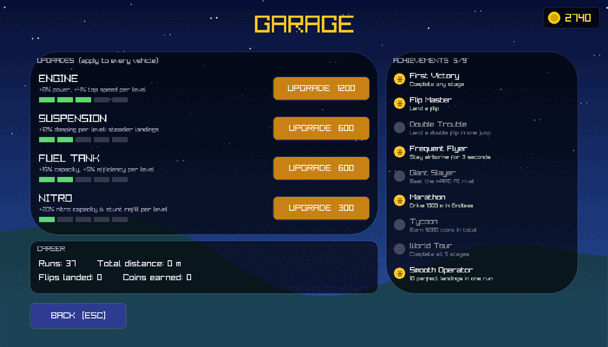
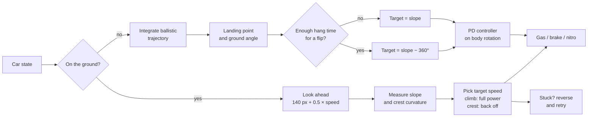

<div align="center">

# 🚗💨 HILL CLIMB RACER 🏔️

### Physics, AI rivals and big air: a 2D hill climber in pure C

[](https://edgar-50.github.io/HillClimbRacer/)
[](https://github.com/Edgar-50/HillClimbRacer/actions/workflows/deploy-web.yml)


-ff9f1a?style=flat-square)



**Race an AI that reads the terrain. Chase your own ghost. Flip, boost, upgrade and climb forever.**
Everything you see and hear (terrain, physics, AI, particles, even the engine sound) is generated in code. No engine, no physics library, no asset files.

</div>

---

## 🎮 Play it

| | |
|---|---|
| 🌐 **Browser** | **[edgar-50.github.io/HillClimbRacer](https://edgar-50.github.io/HillClimbRacer/)**. Nothing to install, and progress is saved in your browser. |
| 🖥️ **Desktop** | `make && make run` (see [Build](#-build) below) |

---

## ✨ Highlights

<table>
<tr>
<td width="50%" valign="top">

### 🤖 A rival that actually thinks
The **AI rival** looks ahead along the track and chooses its speed from the slope and curvature it sees coming. It floors it on climbs, lifts before crests so it doesn't launch, and saves nitro for the steep bits. In the air it **predicts its own landing**, reads the ground angle there, and steers rotation with a PD controller to touch down flat. With enough hang time it throws in a **backflip**.

Choose **Easy**, **Normal** or **Hard**. Hard is *ACE*: zero reaction lag.

</td>
<td width="50%" valign="top">

### 🧠 AI coach and autopilot
The **coach** reads your driving live:
- ⛽ *"Fuel critical: ~40 m range, next can in 55 m"*, estimated from your **real** fuel use per metre
- ⛰️ Steep-climb and sharp-crest warnings ahead of time
- 🎯 In the air: a **predicted landing arc**, a landing marker, and *"tilt nose DOWN"*

Press **TAB** and the same AI takes the wheel: **autopilot**.

</td>
</tr>
<tr>
<td valign="top">

### 🏆 Progression
- 🗺️ **6 stages**: Countryside → Desert → Arctic → Volcano → Moon (low-g!) → **ENDLESS**
- 🚙 **3 vehicles**: Jeep · Buggy · Monster truck
- 🔧 **4 upgrade tracks** × 5 levels: Engine, Suspension, Fuel Tank, Nitro
- 👻 **Ghost replay** of your best run on every stage
- 🏅 **9 achievements**, career stats, persistent coin bank

</td>
<td valign="top">

### 🔥 Stunts and speed
- 🚀 **Nitro boost** that refills when you pull off stunts
- 🔄 **Flips**, ✈️ **air time** and 🎯 **perfect landings** pay coins
- ⛓️ Chain stunts within 6 s for a **COMBO ×N** multiplier
- 💥 Crashes when you land on your roof or the driver's head hits the ground
- ⛽ Fuel cans get sparser the further you go

</td>
</tr>
</table>

---

## 📸 Screenshots

<div align="center">

| 🏁 Menu: stages, vehicles, race options | 🌙 Moon: coach and landing predictor |
|:---:|:---:|
|  |  |
| **🌅 ENDLESS with autopilot engaged** | **📊 Results: stats, earnings, rival outcome** |
|  |  |



*🔧 The garage: upgrades, career stats and achievements*

</div>

---

## 🕹️ Controls

| Key | Action |
|:---:|---|
| <kbd>D</kbd> / <kbd>→</kbd> | Gas · *in the air: nose up* |
| <kbd>A</kbd> / <kbd>←</kbd> | Brake / reverse · *in the air: nose down* |
| <kbd>Shift</kbd> / <kbd>Space</kbd> | 🚀 Nitro |
| <kbd>Tab</kbd> | 🤖 Toggle autopilot |
| <kbd>H</kbd> | 🧠 Toggle coach hints |
| <kbd>P</kbd> / <kbd>Esc</kbd> | ⏸️ Pause |
| <kbd>1</kbd>–<kbd>6</kbd>, <kbd>Enter</kbd> | Start a stage from the menu |
| <kbd>G</kbd> | 🔧 Garage |
| <kbd>R</kbd> · <kbd>M</kbd> · <kbd>N</kbd> | Retry · Menu · Next stage |
| 🎮 Gamepad | RT/A = gas · LT/X = brake · RB = nitro |

---

## 🗺️ Stages

| # | Stage | Terrain | Goal | Twist |
|:-:|---|---|:-:|---|
| 1 | 🌳 **Countryside** | Gentle rolling hills | 300 m | Falling leaves |
| 2 | 🏜️ **Desert** | Big sandy dunes | 500 m | Sandstorm streaks |
| 3 | ❄️ **Arctic** | Icy slopes | 650 m | Snowfall |
| 4 | 🌋 **Volcano** | Extreme jagged rock | 800 m | Rising embers |
| 5 | 🌕 **Moon** | Cratered surface | 1000 m | **55% gravity**: huge jumps |
| 6 | 🌅 **Endless** | Sunset hills that keep getting harder | ∞ | How far can you go? |

Stages unlock one after another. **Endless** is always open.

---

## 🧠 How the AI drives



Difficulty changes how the AI behaves, not just its speed: **Easy** reacts every 0.2 s and never flips, **Normal** reacts every 0.08 s, and **Hard** decides every physics tick. In headless test runs the AI finished every finite stage on every difficulty without crashing.

---

## ⚙️ Under the hood

| System | How it works |
|---|---|
| 🏔️ **Terrain** | Slope-momentum random walk with a private deterministic RNG and a difficulty ramp, smoothed with **Catmull-Rom** splines. Height lookup is **O(1)**. |
| 🛞 **Physics** | Fixed **120 Hz** step. Rigid vertical struts, spring-damper suspension, ground alignment and damped air rotation. |
| 🎁 **Pickups** | Coins, gold coins, fuel and bridges stream in ahead of you from recycled pools. |
| 👻 **Ghosts** | 20 Hz pose samples, interpolated on playback and saved per stage. |
| 🔊 **Audio** | Engine: two oscillators plus noise through a low-pass filter, pitch follows RPM. All effects are synthesized at start-up. |
| 🎨 **Visuals** | Parallax mountains, clouds, sun / Earth / sunset, weather, particles and camera shake. |
| 💾 **Saves** | Plain-text `hcr_save.txt` plus `hcr_ghost_N.bin`. In the browser, saves go to IndexedDB. |

---

## 🔨 Build

You need **raylib 5.x**.

```bash
# Linux / macOS / Windows (MinGW): the Makefile detects your platform
make
make run
```

<details>
<summary><b>📦 Installing raylib</b></summary>

```bash
# Ubuntu / Debian
sudo apt install libraylib-dev
# Arch
sudo pacman -S raylib
# Fedora
sudo dnf install raylib-devel
# macOS
brew install raylib
```
On Windows, grab a release from <https://github.com/raysan5/raylib/releases>.
</details>

<details>
<summary><b>🌐 Building the web version</b></summary>

```bash
# with emsdk active
git clone --depth 1 --branch 5.5 https://github.com/raysan5/raylib.git
make -C raylib/src PLATFORM=PLATFORM_WEB
make web            # → build/web/index.html
python3 -m http.server -d build/web
```
Every push to `main` rebuilds the web version and publishes it to GitHub Pages via
[`.github/workflows/deploy-web.yml`](.github/workflows/deploy-web.yml).
</details>

---

## 📁 Project layout

```
hill_climb_racer.c        the whole game: physics, AI, rendering, audio, UI
web/shell.html            browser page that hosts the WebAssembly build
Makefile                  native + web builds
.github/workflows/        auto-deploy to GitHub Pages
docs/screenshots/         images for this README
```

<div align="center">

---

**Made with ❤️, C and a lot of hills.**
⭐ Star the repo if you made it to the Moon!

</div>
